DAFTAR ISI
==========
- [LAPORAN PRAKTIKUM 4](#laporan-praktikum-4)    
    - [CODE PROGRAM NILAI AKHIR](#code-program-nilai-akhir)
    - [FLOWCHART NILAI AKHIR](#flowchart-nilai-akhir)
    - [KESIMPULAN](#kesimpulan)

# LAPORAN PRAKTIKUM 4

## CODE PROGRAM NILAI AKHIR

### Step 1 : Menginisialisasi List Data Mahassiswa
Program dimulai dengan menginisialisasi sebuah list kosong bernama data_mahasiswa untuk menyimpan data setiap mahasiswa. List ini akan diisi dengan data mahasiswa yang diinput selama program berjalan :

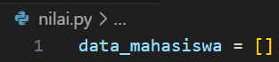

### Step 2 : Input Data Mahasiswa dan Perulangan While
Program kemudian masuk ke dalam sebuah perulangan while yang memungkinkan pengguna untuk memasukkan data mahasiswa secara berulang hingga pengguna memilih untuk berhenti :

- Nama Mahasiswa: Program meminta input nama mahasiswa.
- Nim Mahasiswa: Program meminta input nim mahasiswa.
- Nilai Tugas: Program meminta input nilai tugas mahasiswa dalam bentuk integer.
- Nilai UTS: Program meminta input nilai UTS mahasiswa dalam bentuk integer.
- Nilai UAS: Program meminta input nilai UAS mahasiswa dalam bentuk integer.

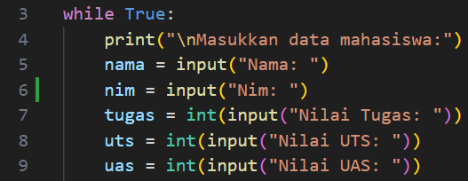

### Step 3 : Menghitung Nilai Akhir
Setelah menerima input nilai tugas, UTS, dan UAS, program menghitung nilai akhir mahasiswa dengan menggunakan formula berikut :

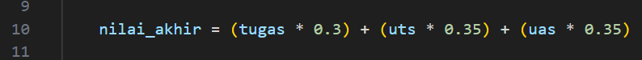

> Formula ini berarti:
> - Nilai tugas memiliki bobot 30% dari nilai akhir.
> - Nilai UTS memiliki bobot 35% dari nilai akhir.
> - Nilai UAS memiliki bobot 35% dari nilai akhir.

### Step 4 : Simpan Data Mahasiswa
Setelah nilai akhir dihitung, program membuat dictionary untuk menyimpan semua informasi tentang mahasiswa (nama, nim, nilai tugas, nilai UTS, nilai UAS, dan nilai akhir). Dictionary ini kemudian ditambahkan ke dalam list data_mahasiswa :

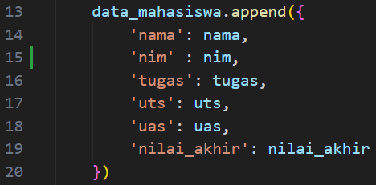

### Step 5 : Code Seleksi Untuk Tanyakan Tambahan Data Mahasiswa
Setelah menyimpan data, program bertanya kepada pengguna apakah ingin menambah data mahasiswa lagi atau tidak. If pengguna mengetik y, program akan mengulangi proses input. Jika pengguna mengetik t, perulangan akan berhenti, berikan perintah break untuk menghentikan Program :

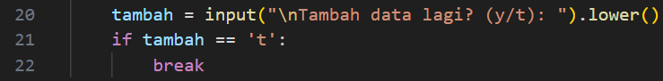

### Step 6 : Print Data Mahasiswa
Setelah perulangan selesai (pengguna memilih t untuk berhenti menambah data), program akan menampilkan daftar data mahasiswa yang telah dimasukkan. Untuk setiap mahasiswa data yang ditampilkan meliputi nama, nim, nilai tugas, nilai UTS, nilai UAS, dan nilai akhir :

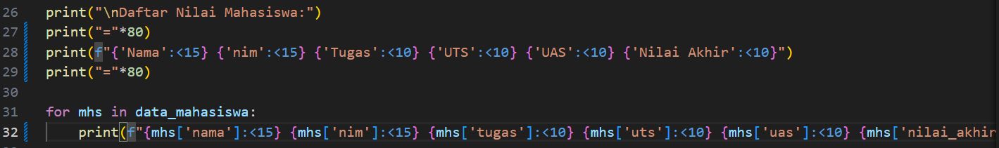

### Step 7 : Beri Batas Bawah
Print '=' dikalikan 80 :

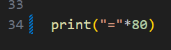

### Step 8 : Test Code Program
Jalankan code program dengan memasukan nama, nilai tugas, nilai uts, nilai uas :

- Nama : Dafa Maulana
- Nim : 312410387
- Nilai Tugas : 90
- Nilai UTS : 55
- Nilai UAS : 80

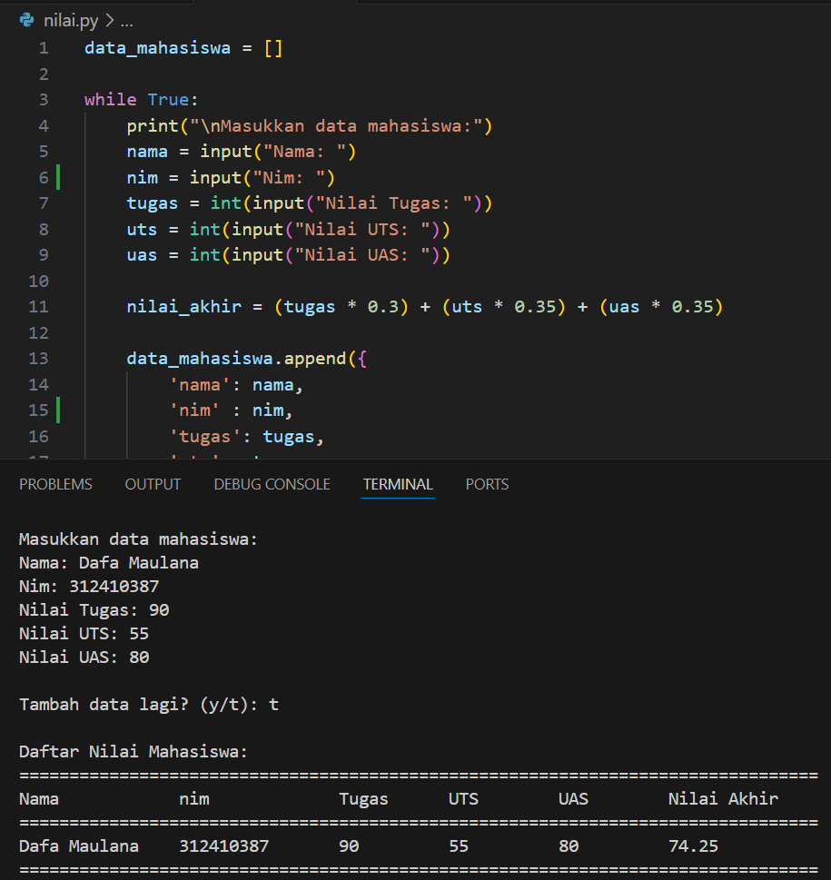

## FLOWCHART NILAI AKHIR

### Step 1 : Start
Titik Mulai :

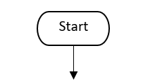

### Step 2 : Input Data Mahasiswa
Buatkan Input Data Mahasiswa dengan mencangkup Nama, Nim, Nilai Tugas, Nilai UTS, Nilai UAS :

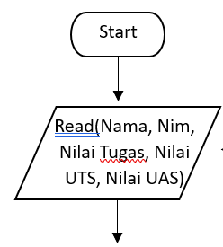

### Step 3 : Lakukan Seleksi
Langkah selanjutnya yaitu buatkan decision atau seleksi berupa pertanyaan Menambahkan Data Mahasiswa (Y/T?), jika Ya maka kemabli ke Input Data mahasiswa, jika Tidak maka lanjut ke langkah selanjutnya :

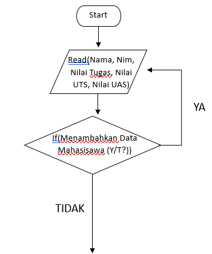

### Step 4 : Proses Perhitungan
Langkah ini untuk memproses Nilai Akhir dari Input nilai nilai yang telah dimasukan :

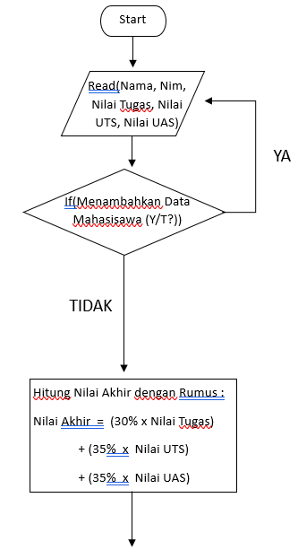

### Step 5 : Output Nilai Akhir
Masuk kelangkah Akhir yaitu menampilkan Nilai Akhir dari Data Mahasiswa yang telah diinputkan dan sudah dihitung :

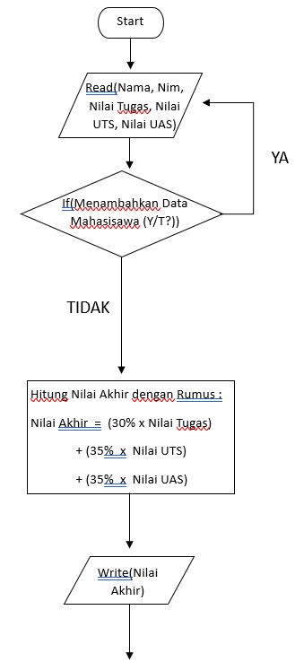

### Step 6 : End
Titik Berhenti :

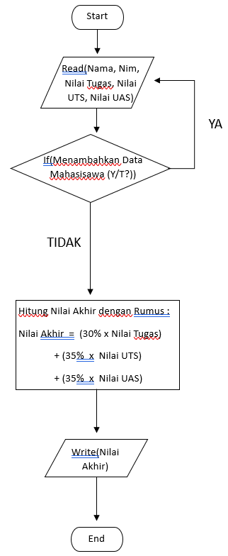

## KESIMPULAN
Kesimpulan dari Laporan Praktikum di atas adalah penggunaan append dapat menambahkan element lain, jika kita perhatikan penggunaan perulangan sangat membantu untuk memastikan jika ada tambahan data yang diinputkan, namun dari semua itu semua adalah kelas dari sebuah List dari tema praktikum kali ini. Penggunaan List berguna untuk mengetahui apa saja yang ada di dalam data, List mampu menampung beberapa element berbeda.