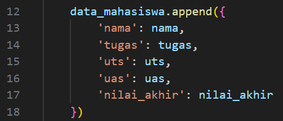

DAFTAR ISI
==========
- [LAPORAN PRAKTIKUM 4](#laporan-praktikum-4)    
    - [CODE PROGRAM NILAI AKHIR](#code-program-nilai-akhir)

# LAPORAN PRAKTIKUM 4

## CODE PROGRAM NILAI AKHIR

### Step 1 : Menginisialisasi List Data Mahassiswa
Program dimulai dengan menginisialisasi sebuah list kosong bernama data_mahasiswa untuk menyimpan data setiap mahasiswa. List ini akan diisi dengan data mahasiswa yang diinput selama program berjalan :

### Step 2 : Input Data Mahasiswa dan Perulangan While
Program kemudian masuk ke dalam sebuah perulangan while yang memungkinkan pengguna untuk memasukkan data mahasiswa secara berulang hingga pengguna memilih untuk berhenti :

- Nama Mahasiswa: Program meminta input nama mahasiswa.
- Nilai Tugas: Program meminta input nilai tugas mahasiswa dalam bentuk integer.
- Nilai UTS: Program meminta input nilai UTS mahasiswa dalam bentuk integer.
- Nilai UAS: Program meminta input nilai UAS mahasiswa dalam bentuk integer.

### Step 3 : Menghitung Nilai Akhir
Setelah menerima input nilai tugas, UTS, dan UAS, program menghitung nilai akhir mahasiswa dengan menggunakan formula berikut :

> Formula ini berarti:
> - Nilai tugas memiliki bobot 30% dari nilai akhir.
> - Nilai UTS memiliki bobot 35% dari nilai akhir.
> - Nilai UAS memiliki bobot 35% dari nilai akhir.

### Step 4 : Simpan Data Mahasiswa
Setelah nilai akhir dihitung, program membuat dictionary untuk menyimpan semua informasi tentang mahasiswa (nama, nilai tugas, nilai UTS, nilai UAS, dan nilai akhir). Dictionary ini kemudian ditambahkan ke dalam list data_mahasiswa :

### Step 5 : Code Seleksi Untuk Tanyakan Tambahan Data Mahasiswa
Setelah menyimpan data, program bertanya kepada pengguna apakah ingin menambah data mahasiswa lagi atau tidak. If pengguna mengetik y, program akan mengulangi proses input. Jika pengguna mengetik t, perulangan akan berhenti, berikan perintah break untuk menghentikan Program :

### Step 6 : Print Data Mahasiswa
Setelah perulangan selesai (pengguna memilih t untuk berhenti menambah data), program akan menampilkan daftar data mahasiswa yang telah dimasukkan. Untuk setiap mahasiswa data yang ditampilkan meliputi nama, nilai tugas, nilai UTS, nilai UAS, dan nilai akhir :

### Step 7 : Output
Print Output dari eksekusi code program :

### Step 8 : Test Code Program
Jalankan code program dengan memasukan nama, nilai tugas, nilai uts, nilai uas :
- Nama : Dafa Maulana Makmudin
- 